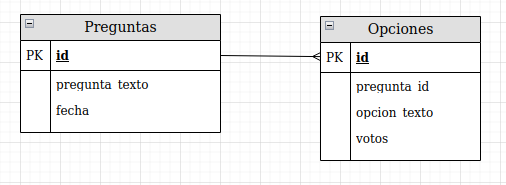

# Practica con Djago de una encuesta
Encuesta web sobre los personajes de Rick y Morty escrito en Django

## Primeros pasos

Se instala el framework Django en el entorno virtual de python:

```console
$ pip install django
```

Siempre inicializamos un proyecto como:

```console
$ django-admin startproject <nombre_del_proyecto>
```

Para inicializar un servidor local de desarrollo, debemos ejecutar:

```console
$ python manage.py runserver <optional: puerto>
```

Para crear una nueva app para el proyecto, ejecutamos:

```console
$ python manage.py startapp <nombre_de_la_app>
```

## Diseñando los diagramas Entidad-Relación para el ORM

El diagrama de como estarán relacionados los objetos del ORM es el siguiente:



## Creación de los Modelos
Los modelos son equivalentes en ORM a las tablas en una base de datos relacional. 
Para crearlas, definimos nuestros modelos en el archivo models dentro de la app `encuesta`, y se definen como clases.

Después de definir las clases de los modelos, debemos agregar las definiciones al archivo `settings.py` para que Django sepa que existen. Esto se hace agregando a la lista INSTALLED_APPS el siguiente elemento:

`"<nombre_de_la_app>.apps.<nombre_de_la_app>Config"`

o en otras palabras, se agrega toda la ruta a la clase definida en el archivo apps.py en la carpeta de la app que estamos trabajando.

Una vez hecho esto, debemos ejecutar los siguientes comandos que crearan las migraciones de las clases definidas a tablas en la Base de Datos.

```console
$ python manage.py makemigrations encuesta
```
 
 El anterior comando convierte nuestros modelos en una descripción para que se puedan crear las tablas en la BD.

 ```console
 $ python manage.py migrate
 ```

 Django toma la descripción y la ejecuta por debajo en SQL sobre la BD directamente usando el parádigma ORM.

 ## Creando superuser para ingresar al Administrador de Django
 Django permite la manipulación de los datos de forma interactiva y con una GUI, llamado Administrados. Para ingresar a él, debemos crear primero un superusuario

 ```console
 $ python manage.py createsuperuser
 ```

 Después, debemos agregar al archivo `admin.py` de la aplicación la instrucción para que exponga los modelos dispobles para modificar, en este caso, Pregunta y Opcion.

 ```python
from django.contrib import admin
from .models import Pregunta, Opcion

admin.site.register(Pregunta)
 ```

 Además, podemos personalizar le estructura en como se presentan los datos, extendiendo la clase `admin.ModelAdmin` como sigue:

 ```python
 class OpcionInLine(admin.TabularInline):
    model = Opcion
    extra = 1


class PreguntaAdmin(admin.ModelAdmin):
    fields = ["pregunta_texto"]
    inlines = [OpcionInLine]

    # Campos que se muestran en el entorno gráfico
    list_display = ["pregunta_texto", "id", "fecha_publicacion"]
    # Agrefamos una barra de filtración

    list_filter = ["fecha_publicacion"]
    
    # Agregamos una barra de busqueda sobre un campo
    search_fields = ["pregunta_texto"]


admin.site.register(Pregunta, PreguntaAdmin)
 ```

 Ahora sí, podemos echar a andar el server donde nos muestre el proyecto que estamos desarrollando. Esto se hace con el siguiente comando:

 ```console
 $ python manage.py runserver
 ```

E ingresamos a la dirección [http://127.0.0.1:8000/admin/](##) y nos loggeamos con el user y el password que definimos arriba.

Dentro de la interface gráfica del administrador, podremos agregar y modificar datos.
