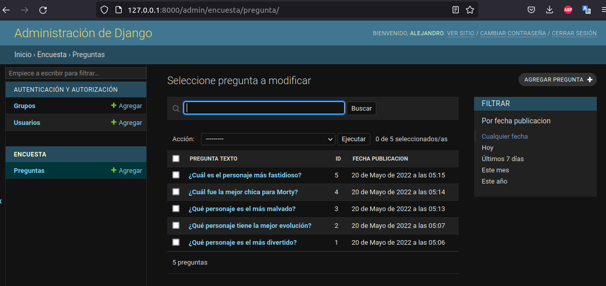

# Practica con Djago de una encuesta
Encuesta web sobre los personajes de Rick y Morty escrito en Django

## Primeros pasos

Se instala el framework Django en el entorno virtual de python:

```console
$ pip install django
```

Siempre inicializamos un proyecto como:

```console
$ django-admin startproject <nombre_del_proyecto>
```

Para inicializar un servidor local de desarrollo, debemos ejecutar:

```console
$ python manage.py runserver <optional: puerto>
```

Para crear una nueva app para el proyecto, ejecutamos:

```console
$ python manage.py startapp <nombre_de_la_app>
```

## Diseñando los diagramas Entidad-Relación para el ORM

El diagrama de como estarán relacionados los objetos del ORM es el siguiente:


## Creación de los Modelos
Los modelos son equivalentes en ORM a las tablas en una base de datos relacional. 
Para crearlas, definimos nuestros modelos en el archivo models dentro de la app `encuesta`, y se definen como clases.

Después de definir las clases de los modelos, debemos agregar las definiciones al archivo `settings.py` para que Django sepa que existen. Esto se hace agregando a la lista INSTALLED_APPS el siguiente elemento:

`"<nombre_de_la_app>.apps.<nombre_de_la_app>Config"`

o en otras palabras, se agrega toda la ruta a la clase definida en el archivo apps.py en la carpeta de la app que estamos trabajando.

Una vez hecho esto, debemos ejecutar los siguientes comandos que crearan las migraciones de las clases definidas a tablas en la Base de Datos.

```console
$ python manage.py makemigrations encuesta
```
 
 El anterior comando convierte nuestros modelos en una descripción para que se puedan crear las tablas en la BD.

 ```console
 $ python manage.py migrate
 ```

 Django toma la descripción y la ejecuta por debajo en SQL sobre la BD directamente usando el parádigma ORM.

 ## Creando superuser para ingresar al Administrador de Django
 Django permite la manipulación de los datos de forma interactiva y con una GUI, llamado Administrados. Para ingresar a él, debemos crear primero un superusuario

 ```console
 $ python manage.py createsuperuser
 ```

 Después, debemos agregar al archivo `admin.py` de la aplicación la instrucción para que exponga los modelos dispobles para modificar, en este caso, Pregunta y Opcion.

 ```python
from django.contrib import admin
from .models import Pregunta, Opcion

admin.site.register(Pregunta)
 ```

 Además, podemos personalizar le estructura en como se presentan los datos, extendiendo la clase `admin.ModelAdmin` como sigue:

 ```python
 class OpcionInLine(admin.TabularInline):
    model = Opcion
    extra = 1


class PreguntaAdmin(admin.ModelAdmin):
    fields = ["pregunta_texto"]
    inlines = [OpcionInLine]

    # Campos que se muestran en el entorno gráfico
    list_display = ["pregunta_texto", "id", "fecha_publicacion"]
    # Agrefamos una barra de filtración

    list_filter = ["fecha_publicacion"]
    
    # Agregamos una barra de busqueda sobre un campo
    search_fields = ["pregunta_texto"]


admin.site.register(Pregunta, PreguntaAdmin)
 ```

 Ahora sí, podemos echar a andar el server donde nos muestre el proyecto que estamos desarrollando. Esto se hace con el siguiente comando:

 ```console
 $ python manage.py runserver
 ```

E ingresamos a la dirección [http://127.0.0.1:8000/admin/](##) y nos loggeamos con el user y el password que definimos arriba.

Dentro de la interface gráfica del administrador, podremos agregar y modificar datos.



## Creación de los views
Los Views son las funcionalidades que tendrán por detrás cada vez que accedemos a un template. En pocas palabras, los views son el backend y los template los frontend.

Puede hacer dos tipos de views según su funcionalidad: **Function Based Views** que están basadas en funciones de python, y **Generic Views** basadas en clases.

Existen ciertos criterios para elegir uno u otra forma de construir los views: 
* Si las funcionalidades son genericas, o sea presentar lista de opciones, presentar formularios, logearte, etc. Es preferible usar *Generic Views*. 
Principalmente se usan cuando la funcionalidad sigue este patrón de tareas:

    **Consulto la Base de Datos -> Traigo Datos -> Creo una Template -> Presento en Internet.**

    Aquí dos referencia para revisar:
    * http://ccbv.co.uk/
    * https://docs.django.project.com/en/4.0/ref/class-based-views/


* Si, las funcionalidades son muy especificas, personalizada que no tienen parecido a las funcionalidades ofrecidas por las *Generic Views*, entonces, usaremos *Function Based Views*.

Las views son declaradas en el archivo `views.py` dentro de la carpeta de la correspondiente app. Una vez que son declaradas, hay que agregar su referencia en el archivo `urls.py` de la carpeta aplicación:

```python
from django.urls import path

from . import views

app_name = "encuesta"

urlpatterns = [
    # Ejemplo de la ruta: /encuesta/
    path('/', views.IndexView.as_view(), name='index'),
    # Ejemplo de la ruta: /encuesta/detalle/5/
    path('/detalle/<int:pk>/', views.DetalleView.as_view(), name='detalle'),
    # Ejemplo de la ruta: /encuesta/resultado/5
    path('/resultado/<int:pk>/', views.ResultadoView.as_view(), name='resultado'),
    # Ejemplo de la ruta: /encuesta/votos/5
    path('/votos/<int:pk>/', views.ResultadoView.as_view(), name='voto')
]
```

Una vez declaradas las rutas donde se invocaran las views, hay que incluirlas en la lista de rutas de la aplicación principal. Esto se hace en el archivo `urls.py` en la carpeta del proyecto principal.
En dicho archivo, ya viene documentado la forma en como se deben incluir las rutas. En este caso será como sigue:

```python
from django.contrib import admin
from django.urls import path, include

urlpatterns = [
    path('admin/', admin.site.urls),
    # La siguente línea es la que se agrega:
    path('encuesta/', include('encuesta.urls'))
]
```

## Templates

Cada view se puede ligar a un frontend en forma de **template**. Los templates son páginas html que mostraran los resultados de los views, y es la forma en como nuestra app interactua con el usuario.

Para crear los templates, debemos hacer una carpeta nueva en el directorio de la aplicación llamada **/templates/<nombre de la aplicación>/**. Adentro, para cada view, debemos crear una template con el mismo nombre que la vista.

Django tiene un lenguaje para crear templates de una aplicación: **Django template system**, el cual sirve para agregar o manipular el frontend html de la app.

En dicho lenguaje, las instrucciones de python se escriben entre ****, por ejemplo

```django

    *html*

```

El motor de templates, usa **** para todo lo que son bloques, operaciones, condicionales, ciclos. Mientras que se usa **{{   }}** para llamar variables.

En el directorio `/templates/encuesta/` hay ejemplos de como usar templates.

### Tags o etiquetas
Para trabajar mejor con respecto a referencias u otras funcionalidades en los templates, el **Django Template Language**, tiene tag que nos dan funcionalidades utiles, por ejemplo la etiqueta **url** que nos sirve para evitar el hardcodeo al escribir las direcciones url de nuestro proyecto, y mejor referenciarlas con nombres, por ejemplo:

```html
<form action="" method="post">
```

Usar nombres en lugar de la ruta completa es posible si declaramos en el archivo `urls.py` de la app, un app_name para hacer referencia al nombre de la aplicación y el nombre del path ahi mismo declarado.

## Agregando Static Files (CSS, Imágenes)

Los archivos estáticos de nuestros templates, como archivos css, javascript, o imagenes se deben poner en el directorio `/static/encuesta/` dentro de la carpeta de la aplicación.

Para poder indicarle al html que archivos importar con los estilos o los script de js, o imagenes, debemos darle la siguientes instrucciones, y la forma de invocarlos:

```django

<link rel="stylesheet" href="">
```